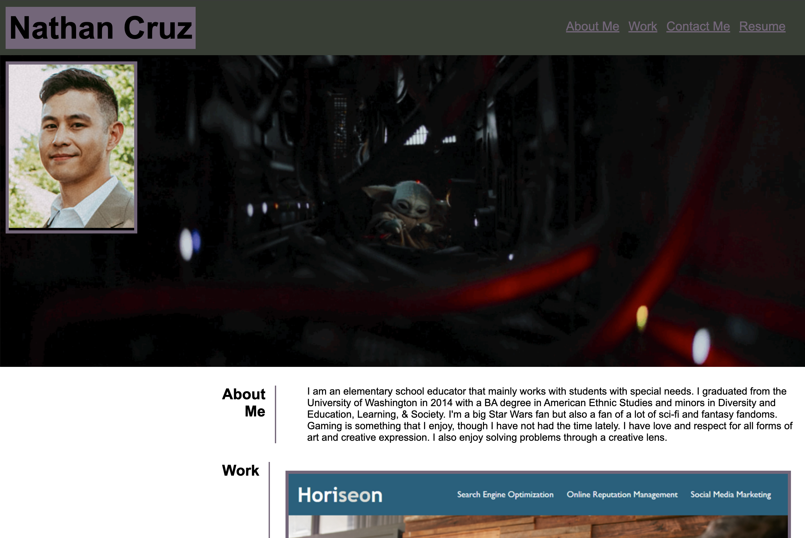

# N Cruz's Coding Portfolio

## Description

This project was a challenge assigned to us where we had to create a proffesional developer portfolio from scratch. The page had to display our name, a recent photo, and links to sections about ourselves, our work, and a way to contact us. When clicking the links, the UI had to move to that section on the page and when clicking on the images of our work, they had to lead to that URL. The page also had to be responsive to different devices or when the browser window was resized. 

I ran into a few issues trying to get the media query to work right for different device screen sizes. The sections displaying images of our work would not completely resize along with the viewport. Also, lining up elements perfectly to each other while using flexboxes did not always work out. I challenged myself to see if I could create a portfolio like the one in the mock up and it did prove a little difficult for some areas.

This project did help me get more comfortable with CSS and especially understanding the box model when I had to use padding and margins. To know that I actually got fairly close to the mock up example image was a good feeling.

## Usage

This project serves as a professional portfolio for potential employers to view and for myself to continously update as I go through a coding bootcamp. 

[Link to portfolio](https://crzn24.github.io/ncruz-coding-portfolio/)

## Credits

* [StackOverflow](https://stackoverflow.com/questions/3956043/css-how-to-position-element-in-lower-right)

## License

No License

